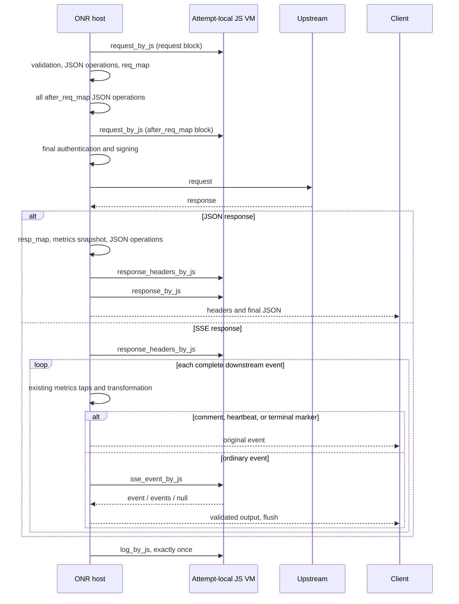

# JavaScript phase extensions

ONR supports opt-in, synchronous JavaScript function bodies in provider DSL. The implementation through **phase 3 (ONR integration)** lives in this repository. The reusable engine is `onr-core/pkg/jsext`; Relay integration and publishing an onr-core release are separate work.

See the [DSL reference](../DSL_SYNTAX.md#9-javascript-phase-extensions), [executable provider fixture](../onr/internal/proxy/testdata/js/provider.conf), [file handler](../onr/internal/proxy/testdata/js/after-map.js), and [design review](https://github.com/edgefn/next-router-docs/pull/89).

## Declare a handler

```nginx
provider "example" {
    defaults {
        upstream_config { base_url = "https://api.example.com"; }
        js_timeout 200ms;
        js_stream_timeout 10ms;
        js_body_limit 8m;
        js_event_limit 1m;

        request {
            request_by_js_block {
                const body = JSON.parse(ctx.request.body);
                ctx.state.messageCount = (body.messages || []).length;
                body.metadata = {source: "onr"};
                ctx.request.body = JSON.stringify(body);
            }
            after_req_map {
                request_by_js_block {
                    ctx.request.headers["x-message-count"] = [
                        String(ctx.state.messageCount)
                    ];
                }
                json_set "$.metadata.checked" true;
            }
        }
        response {
            response_headers_by_js_block {
                ctx.response.headers["x-policy"] = ["checked"];
            }
            response_by_js_block {
                const body = JSON.parse(ctx.response.body);
                delete body.internal_trace;
                ctx.response.body = JSON.stringify(body);
            }
            sse_event_by_js_block {
                return ctx.event;
            }
        }
        log_by_js_block {
            ctx.log.info("attempt completed", {outcome: ctx.result.outcome});
        }
    }
    match api = "chat.completions" {
        upstream { set_path "/v1/chat/completions"; }
    }
}
```

There is no `request_after_map_by_js_block`. The parent block selects the request stage. The inner handler runs after **all** `after_req_map` JSON operations, including operations written after the handler, and also runs without `req_map`.

Each prefix supports `_by_js_block { ... }`, `_by_js_file scripts/name.js;`, and `_by_js off;`. A file contains the same strict function body as an inline block, with no exported entry point. `return;` is valid. There is no manifest, schema, plugin registration, npm, `require`, `import`, async, Promise, generator, or dynamic `eval` / `Function` support.

## Stages and inheritance

| Stage | Owning DSL block | Prefix | Mutable output |
| --- | --- | --- | --- |
| Before request mapping | `request` | `request` | JSON body and allowed headers |
| After complete request mapping | `request.after_req_map` | `request` | JSON body and allowed headers |
| Before downstream headers | `response` | `response_headers` | Allowed response headers |
| Final non-stream body | `response` | `response` | JSON body |
| Complete downstream SSE event | `response` | `sse_event` | Event, event array, or `null` |
| Attempt completion | `defaults` / `match` | `log` | State and logging only |

The first matching `match` inherits each defaults slot independently. A declaration replaces that slot; `off` disables it. Declaring block/file/off twice for the same slot is an error, including across includes and repeated `request` or `after_req_map` blocks. Limits inherit per field. Durations must be positive; size suffixes `k` and `m` use powers of 1024. Body/event limits cannot exceed 1 GiB.



An OAuth 401 refresh creates a fresh attempt from the original input, increments `ctx.meta.attempt`, and resets state. It keeps the same provider/script/authorization snapshot. Script failure or rejection is terminal and does not trigger an OAuth retry. The host runs log cleanup with a fresh timeout even when the client canceled; log failures are recorded separately.

## Context contract

- `ctx.meta` is deeply read-only: `requestId`, `attempt`, `provider`, `api`, `originalModel`, `upstreamModel`, `stream`.
- `ctx.state` is private to one attempt and shared between its hooks. Locals are scoped to each function body.
- `ctx.request` and `ctx.response` contain a UTF-8 body string and lowercase header names mapped to string arrays. Method, path, content type, response status, request model and stream selection cannot be changed. Request path omits the query string to avoid exposing query credentials. Response/SSE/log stages see read-only final request views.
- Authorization, cookies, API keys, Host, framing, encoding and hop-by-hop headers are hidden and protected. Content-Type changes are rejected. Hosts generate authentication and signatures after request hooks.
- `ctx.reject(status, body)` stops the attempt with a JSON response; status must be an integer from 400 to 599. It is available in request, response-header and non-stream response stages, never SSE/log.
- Ordinary hooks must return `undefined`. SSE must explicitly return an event, up to 64 events, or `null`; omitted returns are errors. Events have string fields `event`, `data`, `id`, `retry`; replacement events require `data`. Newlines in framing fields and carriage returns in replacement data are rejected.
- `ctx.result` is read-only in log: `outcome`, `status`, optional `usage` and `finishReason`. Outcomes are `success`, `rejected`, `upstream_error`, `script_error`, `canceled`.

Body hooks require JSON. Binary and multipart bodies fail explicitly when a body hook applies. ONR's pre-existing request parser does not support compressed incoming JSON; this extension does not add that feature. Response limits apply after decompression. JSON versus SSE dispatch follows the actual upstream response format, including JSON error responses to streaming requests.

SSE framing handles fragmented reads, CRLF, CR, multiline data and comments. Unmodified events retain their bytes. Terminal markers include `[DONE]`, Responses completion/failure/incomplete events, and Claude `message_stop`; hosts can provide another predicate through `TerminalEvent`. Gemini streams have no independent end marker to synthesize. The writer never adds a terminal event or offers an end-of-stream output hook.

Existing usage and finish-reason taps stay before downstream JS changes. Removing usage, dropping events, or failing downstream JS does not change facts already collected. ONR returns those facts alongside errors and still records billing. Errors after response commitment cancel upstream processing and close the stream without appending a JSON error.

## Files, HTTP and reload

```yaml
js:
  root: ./js
  reload: off # off, watch, poll
  http:
    example:
      enabled: true
      allowed_origins:
        - https://policy.example.com
      timeout: 500ms
      max_timeout: 1s
      max_calls_per_hook: 3
      max_request_body_bytes: 1048576
      max_response_body_bytes: 1048576
```

Paths are relative to the process working directory, as with the other ONR path settings. File handlers are relative to `js.root`; absolute paths, traversal and symlink escapes are rejected using traversal-resistant filesystem opens. Script files are limited to 8 MiB. Remote DSL cannot download script files. No request performs script file I/O.

`off` disables automatic script watching, not explicit reload. `watch` uses filesystem notifications; `poll` checks the script tree once per second. Every trigger prepares the full provider/mode/script/authorization snapshot before publishing. Missing scripts, invalid JS, invalid DSL or skipped provider files reject the complete reload, retaining the old snapshot. Scripts are cached within each prepare transaction; programs are shared across requests, VMs are not.

HTTP grants are read from the host YAML again on reload. Changing `js.root` or `js.reload` requires a restart so watcher ownership cannot silently diverge. Failed reloads do not partially publish new grants. In-flight requests retain their original grants.

Only request and non-stream response body hooks may use synchronous HTTP:

```javascript
const checked = ctx.http.request({
    url: "https://policy.example.com/check",
    method: "POST",
    headers: {"content-type": ["application/json"]},
    body: JSON.stringify({input: JSON.parse(ctx.request.body)}),
    timeoutMs: 300
});
if (checked.status !== 200) {
    throw new Error("policy service failed");
}
if (JSON.parse(checked.body).allow !== true) {
    return ctx.reject(403, {error: "content rejected"});
}
```

Origins match scheme, hostname and effective port. DNS results and connected addresses must be public. Private/link-local/reserved destinations, redirects, environment proxies and credential forwarding are forbidden. HTTP 4xx/5xx are returned normally; network, permission, quota and timeout failures throw. Effective timeout is the minimum of the requested/default timeout, the host maximum, and the remaining hook deadline. Cancellation reaches the HTTP transport.

## Reuse and tooling

`Provider.Prepare` / `Compiler.Prepare` produce immutable configurations; `Provider.Select` resolves inheritance into `CompiledHandlers`. A host calls `NewSession`, `Run`, `NewSSEWriter`, and `Finish`. Nil sessions implement the disabled fast path. `Terminal(err)` tells a host not to retry. `Registry.ReloadFromPathWithJS` publishes an atomic snapshot; `Registry.Snapshot` pins one version. None of the `jsext` code imports Gin or Next Router shared packages.

The shared DSL scanner, include processor, validator, packer and `dsllang` editor layer recognize the same JS syntax islands. Formatting preserves the entire braced body. Bundles preserve file references and add ordinary `# onr-js-origin:` comments for original inline source diagnostics. These comments do not alter JS source. The shared LSP layer provides directive metadata, JS syntax diagnostics, and isolates JS from DSL parsing; this change does not publish a new standalone editor extension.

Scripts are trusted operator configuration, not an untrusted multi-tenant sandbox. Goja interrupts JavaScript execution and host HTTP observes context deadlines, but native engine operations are not hard-preemptible and VM heap allocations have no hard memory quota. Operators must bound retained `ctx.state`; body and event limits do not cap arbitrary JS allocations.

## Verification

Regression coverage includes lexical islands, inheritance/off/duplicate scopes, file escapes, full-snapshot rollback, HTTP grants, cancellation, bounded output, attempt isolation, complete SSE frames, terminal protection, usage preservation, actual-format dispatch, and OAuth retries. Fixtures in `onr/internal/proxy/testdata/js` run through real ONR proxy calls against mock upstream servers.

```bash
go test ./...
go -C onr-core test ./...
go -C onr-core test -race ./...
go test -race ./onr/internal/proxy ./onr/internal/onrserver ./pkg/config
go -C onr-core test ./pkg/jsext -run '^$' -bench BenchmarkHooks -benchmem
go build ./cmd/onr ./cmd/onr-admin ./cmd/onr-pack
```

`onr -t -c onr.yaml` also prepares referenced JS files without executing hooks or contacting policy services. `onr-pack --check-only` validates DSL and inline bodies; resolving file handlers requires host configuration and is checked by `onr -t`.

### Local performance sample

One Linux/amd64 run on an 8-vCPU Haswell VM, using `BenchmarkHooks` with 1-second benchmark-only hook budgets to avoid scheduler contention affecting measurement:

| Case | Mean | p50 | p95 | p99 | Allocated per attempt |
| --- | --- | --- | --- | --- | --- |
| Disabled session | 166 ns | 125 ns | 129 ns | 148 ns | 0 B / 0 allocations |
| Log only | 245 µs | 207 µs | 419 µs | 867 µs | 72,876 B |
| JSON rewrite | 411 µs | 317 µs | 729 µs | 1,501 µs | 85,741 B |
| 256 SSE events | 9.40 ms | 9.11 ms | 12.56 ms | 13.89 ms | 2,077,473 B total |

The SSE sample includes VM creation and reports mean time to first event of 396 µs. `/usr/bin/time -v` recorded 22,848 KiB maximum process RSS across the benchmark suite, including the Go runtime. These are local engine measurements, not end-to-end gateway latency, isolated per-VM peak memory, or release thresholds. Production defaults remain 200 ms per ordinary hook and 10 ms per SSE event. A preliminary run alongside race compilation exceeded the 10 ms stream budget under scheduler contention; limits are configurable and load testing remains necessary before rollout.
