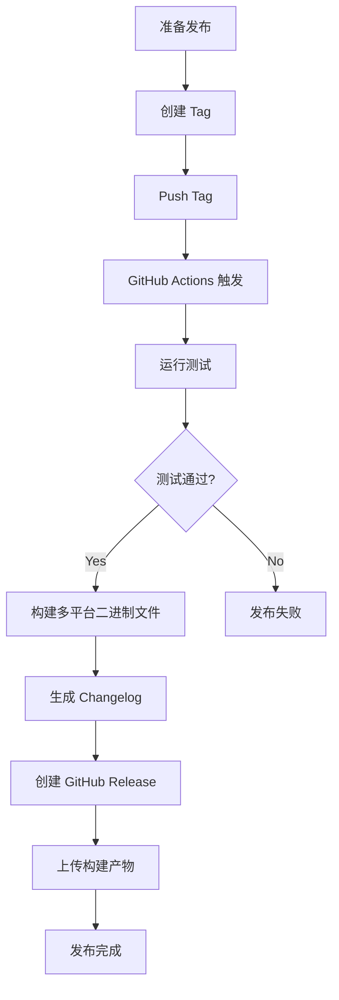

# 版本管理和发布指南

本项目使用自动化的版本管理和发布流程，基于 **语义化版本控制** 和 **Conventional Commits** 规范。

## 快速开始

### 查看当前版本

```bash
make version
```

或运行程序查看版本：

```bash
./bin/onr --version
```

### 创建新版本发布

1. **确保所有改动已合并到主分支**

```bash
git checkout main
git pull origin main
```

2. **查看当前版本**

```bash
git describe --tags --abbrev=0
# 示例输出: v0.1.0
```

3. **根据 commit 历史确定新版本号**

查看自上次发布以来的 commits：

```bash
git log $(git describe --tags --abbrev=0)..HEAD --oneline
```

根据 commit 类型确定版本号：
- 有 `BREAKING CHANGE:`（不兼容变更）→ **Major** 版本升级 (v1.0.0 → v2.0.0)
- 有 `feat:`（新功能）→ **Minor** 版本升级 (v1.0.0 → v1.1.0)
- 只有 `fix:`/`docs:`/`chore:` 等 → **Patch** 版本升级 (v1.0.0 → v1.0.1)

4. **创建并推送版本 tag**

```bash
# 创建 tag（根据上一步确定的版本号）
git tag -a v1.2.0 -m "Release v1.2.0"

# 推送 tag 到 GitHub
git push origin v1.2.0
```

5. **自动化流程执行**

推送 tag 后，GitHub Actions 会自动：
- ✅ 运行所有测试
- ✅ 构建多平台二进制文件（Linux/Windows/macOS，amd64/arm64）
- ✅ 生成 Changelog
- ✅ 创建 GitHub Release
- ✅ 上传构建产物和 checksum
- ✅ 上传 config 压缩包（`open-next-router_config_vX.Y.Z.tar.gz`，包含 `config/providers/*.conf` 与 `config/*.example.yaml`）

6. **验证发布**

访问 [GitHub Releases](https://github.com/r9s-ai/open-next-router/releases) 查看新发布的版本。

---

## Commit Message 规范

本项目遵循 [Conventional Commits](https://www.conventionalcommits.org/) 规范。

### 格式

```
<type>(<scope>): <subject>

<body>

<footer>
```

### Type 类型

| Type | 说明 | 版本影响 |
|------|------|---------|
| `feat` | 新功能 | Minor 升级 |
| `fix` | Bug 修复 | Patch 升级 |
| `docs` | 文档更新 | 无 |
| `style` | 代码格式调整（不影响功能） | 无 |
| `refactor` | 代码重构 | 无 |
| `perf` | 性能优化 | Patch 升级 |
| `test` | 测试相关 | 无 |
| `build` | 构建系统或依赖更新 | 无 |
| `ci` | CI 配置更新 | 无 |
| `chore` | 其他杂项 | 无 |
| `revert` | 回滚之前的 commit | 视回滚内容而定 |

### Scope（可选）

指明改动的范围，例如：`api`, `router`, `config`, `dsl` 等。

### Subject

简短描述，使用现在时态，不超过 50 字符。

### Body（可选）

详细说明改动的原因、方式和影响。

### Footer（可选）

- 关联 issue: `Closes #123`
- 不兼容变更: `BREAKING CHANGE: <description>`

### 示例

#### 新功能
```
feat(router): add support for weighted routing

Implement weighted routing algorithm to distribute traffic
based on configurable weights for each backend.

Closes #42
```

#### Bug 修复
```
fix(dsl): resolve parsing error for nested conditions

Fixed an issue where nested if-else conditions in DSL
were not properly parsed, causing runtime errors.

Fixes #58
```

#### 不兼容变更
```
feat(api): redesign configuration API

BREAKING CHANGE: The configuration API has been redesigned.
The old `/api/v1/config` endpoint is removed. Use `/api/v2/config` instead.

Migration guide: see docs/migration-v2.md
```

---

## 版本号规范

遵循 [Semantic Versioning 2.0.0](https://semver.org/)：

```
v{Major}.{Minor}.{Patch}[-{Pre-release}][+{Build}]
```

### 示例

- `v1.2.3` - 正式版本
- `v2.0.0-beta.1` - Beta 预发布版本
- `v1.0.0-rc.2` - Release Candidate
- `v0.1.0` - 初始开发版本

### 版本升级规则

1. **Major**：不兼容的 API 变更
2. **Minor**：向后兼容的新功能
3. **Patch**：向后兼容的 bug 修复

### Pre-release 版本

用于发布测试版本：

```bash
# Alpha 版本（早期测试）
git tag -a v2.0.0-alpha.1 -m "Alpha release for v2.0.0"

# Beta 版本（功能完整，测试中）
git tag -a v2.0.0-beta.1 -m "Beta release for v2.0.0"

# Release Candidate（候选发布版本）
git tag -a v2.0.0-rc.1 -m "Release candidate for v2.0.0"

# 推送
git push origin v2.0.0-beta.1
```

---

## 本地开发

### 安装开发工具

```bash
make install-tools
```

这会安装：
- GoReleaser

### 本地测试构建

在发布前，可以本地测试构建过程：

```bash
# 测试 release 流程（不发布）
make release-dry

# 构建 snapshot 版本
make release-snapshot

# 查看构建产物
ls -lh dist/
```

### 手动构建

```bash
# 构建当前平台的二进制文件
make build

# 查看版本信息
make version

# 运行
./bin/onr --version
```

---

## 工作流程

### 日常开发流程


1. 从 `main` 创建功能分支：
   ```bash
   git checkout -b feat/new-feature
   ```

2. 开发并使用规范的 commit message：
   ```bash
   git commit -m "feat(api): add new endpoint"
   ```

3. 推送并创建 Pull Request

4. 合并后，Draft Release 会自动更新

### 发布流程



---

## 常见问题

### Q: 如何删除错误的 tag？

```bash
# 删除本地 tag
git tag -d v1.2.0

# 删除远程 tag
git push origin :refs/tags/v1.2.0

# 在 GitHub 上手动删除对应的 Release
```

### Q: 发布失败了怎么办？

1. 查看 GitHub Actions 日志找出原因
2. 修复问题后，删除失败的 tag（见上）
3. 重新创建并推送 tag

### Q: 如何发布 Hotfix？

```bash
# 从 main 分支创建 hotfix 分支
git checkout -b hotfix/critical-bug main

# 修复并 commit
git commit -m "fix(router): resolve critical routing bug"

# 合并回 main
git checkout main
git merge hotfix/critical-bug
git push origin main

# 立即发布 patch 版本
git tag -a v1.2.1 -m "Hotfix: critical routing bug"
git push origin v1.2.1
```

### Q: 如何查看即将发布的变更？

访问 GitHub Releases 页面，查看 Draft Release，它会实时更新即将发布的内容。

### Q: Changelog 是如何生成的？

Changelog 由 GoReleaser 基于 git commit history 自动生成，会根据 commit 的 type 自动分类：
- `feat:` → Features
- `fix:` → Bug Fixes
- `perf:` → Performance Improvements
- 等等

---

## 参考资源

- [Semantic Versioning](https://semver.org/)
- [Conventional Commits](https://www.conventionalcommits.org/)
- [GoReleaser Documentation](https://goreleaser.com/)
- [Keep a Changelog](https://keepachangelog.com/)

---

## 自动化配置文件

本项目的版本管理涉及以下配置文件：

- `.goreleaser.yml` - GoReleaser 配置
- `.github/workflows/release.yml` - 自动发布工作流
- `.github/workflows/draft-release.yml` - Draft Release 工作流
- `.github/release-drafter.yml` - Release Drafter 配置
- `CHANGELOG.md` - 变更日志（自动生成）
- `internal/version/version.go` - 版本信息代码
- `.commitlintrc.json` - Commit message 校验规则（可选）
